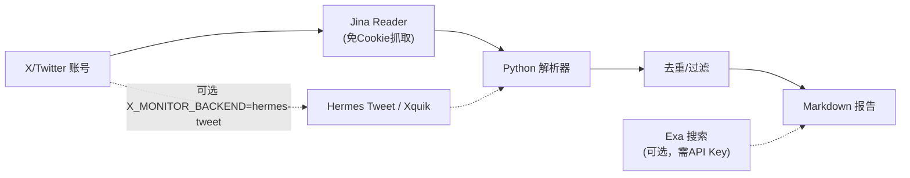

# X/Twitter AI 资讯监控 (x-ai-monitor)

通过 [Jina Reader](https://r.jina.ai) 免认证抓取 X/Twitter 账号页面，自动解析推文、去重过滤、生成 Markdown 报告。

## 亮点

- **零认证**：不需要 Twitter Cookie 或 API Key，开箱即用
- **不重复**：跑多少次都只输出新推文，旧内容自动跳过
- **安静**：自动筛掉导航文案、互动数据、短内容等噪音
- **好配**：改一个 Python 列表就能增减监控账号
- **不绑定**：输出标准 Markdown，想用哪用哪
- **可选结构化读取**：已有 Hermes Tweet / Xquik key 时，可切换账号读取后端

## 工作流



## 前置条件

- Python 3.8+
- `pip install -r requirements.txt`
- 网络能访问 `r.jina.ai`
- （可选）[Exa API Key](https://exa.ai) — 如需全网热搜补充，设置 `EXA_API_KEY` 环境变量
- （可选）Hermes Tweet / Xquik API Key — 设置 `X_MONITOR_BACKEND=hermes-tweet`
  和 `XQUIK_API_KEY`

## 文件结构

```
x-ai-monitor/
├── SKILL.md               # 本文件
├── requirements.txt       # Python 依赖
├── .gitignore
├── scripts/
│   ├── config.py          # 监控账号列表 & 参数（改这个就行）
│   ├── monitor.py         # 主扫描脚本
│   ├── hermes_tweet.py    # Hermes Tweet / Xquik 可选读后端
│   ├── test_hermes_tweet.py # Hermes Tweet 后端单元测试
│   ├── org_scan.py        # 机构号增量扫描
│   └── clean_report.py    # 报告清洗（可选）
├── agents/
│   └── openai.yaml
└── assets/                # 图标资源
```

运行时自动生成：
```
state/              # 运行状态
├── last_run.json   # 已见 hash 列表
└── accounts/       # 各账号推文 JSON
output/             # 报告输出
```

## 安装

把下面这段话发给你的 AI Agent，会自动完成安装和配置：

> 从 https://github.com/Kellen223/x-ai-monitor 安装并运行全量扫描

---

## 快速开始

### 1. 安装依赖

```bash
cd x-ai-monitor
pip install -r requirements.txt
```

### 2. 改配置

编辑 `scripts/config.py`，填入你想监控的账号：

```python
KOL_ACCOUNTS = ["goodside", "kobaltzai", "Thom_Wolf"]
ORG_ACCOUNTS = ["OpenAI", "AnthropicAI", "GoogleDeepMind"]
```

### 3. 运行

```bash
cd scripts

# 全量扫描（KOL + 机构）
python monitor.py

# 仅扫机构号（适合高频增量）
python monitor.py --org-only

# 仅扫 KOL
python monitor.py --kol-only

# 仅扫某个账号
python monitor.py --single goodside

# 跳过 Exa 补充搜索
python monitor.py --no-exa
```

### 4. 可选：切换到 Hermes Tweet / Xquik 读取

默认后端仍是 Jina Reader。需要结构化账号时间线读取时：

```bash
export X_MONITOR_BACKEND=hermes-tweet
export XQUIK_API_KEY=xq_...
python monitor.py --single OpenAI
```

可选变量：

| 变量 | 说明 |
|------|------|
| `X_MONITOR_BACKEND` | `jina` 或 `hermes-tweet` |
| `XQUIK_API_KEY` | Xquik API key |
| `XQUIK_BASE_URL` | Xquik API base URL，默认 `https://xquik.com` |

Hermes Tweet 后端只替换账号推文读取。报告生成、去重、过滤和 Exa 补充搜索仍使用本项目原流程。

## 怎么去重的

每条推文算一个 MD5 hash（取前 12 位），存到 `state/last_run.json` 的已见列表里。下次再跑，已经在列表里的直接跳过。列表上限 3000 条，满了自动淘汰最旧的。

## 过滤了什么

- X 平台导航文案（"Log in"、"Sign up" 等）
- 纯互动数据（点赞数、转发数等）
- 少于 25 字的短内容
- 只有图片没有文字的推文

## 报告长这样

```markdown
# X/Twitter AI 资讯监控报告

## 🤖 KOL 动态

### @goodside
- 如果 LLM 的推理能力继续提升，Agent 的可靠性拐点可能比所有人预期的都要早
- GPT-5 的 chain-of-thought 长度控制比之前好了很多，不再为了思考而思考

### @kobaltzai
- 今天试了 MCP 的 filesystem 沙箱，比我想象的严谨

## 🏢 机构动态

### @OpenAI
- Codex CLI 现在支持自定义 sandbox permissions 了

## 🔥 全网 AI 热搜（Exa）
- [OpenAI 发布 GPT-5.1 新能力](https://...)

## 📊 统计摘要

| 指标 | 数值 |
|------|------|
| KOL 账号 | 12 |
| 机构账号 | 10 |
| 新增推文 | 23 |
```

## 注意事项

- 适合**公开账号**的资讯监控，无法抓取需要登录才能查看的私密推文
- Jina Reader 依赖网络，建议在网络稳定的环境运行
- 默认监控账号列表是示例，用之前务必改成你自己的
- Exa 热搜功能需要设置 `EXA_API_KEY` 环境变量（[获取 Key](https://exa.ai)）

## 参数速查

| 参数 | 说明 |
|------|------|
| `--org-only` | 只扫机构号 |
| `--kol-only` | 只扫 KOL |
| `--single <name>` | 扫单个账号 |
| `--no-exa` | 跳过 Exa 补充搜索 |
